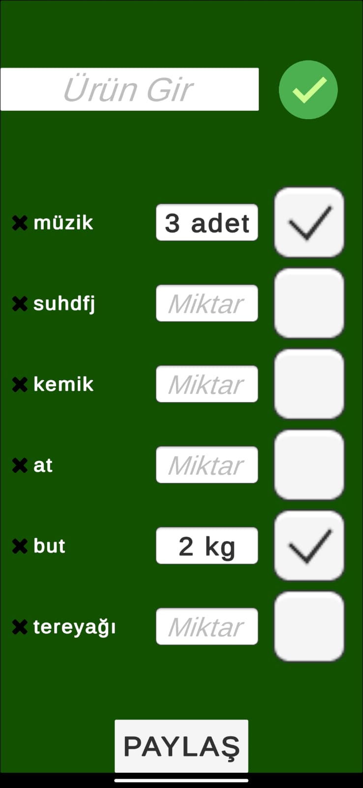

## Features and Usage
- Add items to the list and they will stay there unless you delete them forever.
- From the added items select what is needed and type the needed amount.
- A text will be exported to Whatsapp directly. Select your desired target there.

## Screenshots
.jpeg)
